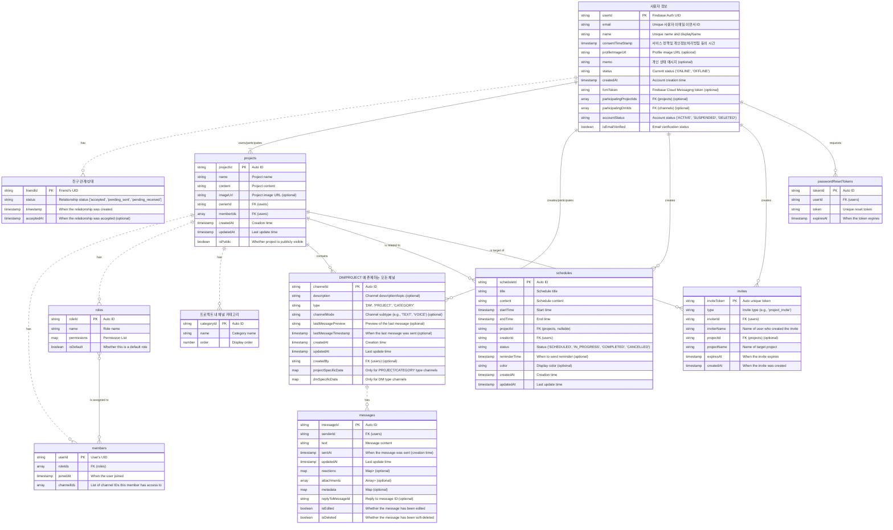

```mermaid
erDiagram
    %% --- Root Collections ---

    users["사용자 정보"] {
        string userId PK "Firebase Auth UID"
        string email "Unique 사용자 이메일 이면서 ID"
        string name "Unique name and displayName"
        timestamp consentTimeStamp "서비스 정책및 개인정보처리방침 동의 시간"
        string profileImageUrl "Profile image URL (optional)"
        string memo "개인 상태 매시지 (optional)"
        string status "Current status ('ONLINE', 'OFFLINE')"
        timestamp createdAt "Account creation time"
        string fcmToken "Firebase Cloud Messaging token (optional)"
        array participatingProjectIds "FK (projects) (optional)"
        array participatingDmIds "FK (channels) (optional)"
        string accountStatus "Account status ('ACTIVE', 'SUSPENDED', 'DELETED')"
        boolean isEmailVerified "Email verification status"
    } 

    channels ["DM/PROJECT 에 존제하는 모든 체널"]{
        string channelId PK "Auto ID"
        string description "Channel description/topic (optional)"
        string type "'DM', 'PROJECT', 'CATEGORY'"
        string channelMode "Channel subtype (e.g., 'TEXT', 'VOICE') (optional)"
        string lastMessagePreview "Preview of the last message (optional)"
        timestamp lastMessageTimestamp "When the last message was sent (optional)"
        timestamp createdAt "Creation time"
        timestamp updatedAt "Last update time"
        string createdBy "FK (users) (optional)"
        map projectSpecificData "Only for PROJECT/CATEGORY type channels"
        map dmSpecificData "Only for DM type channels"
    }

    projects {
        string projectId PK "Auto ID"
        string name "Project name"
        string content "Project content"
        string imageUrl "Project image URL (optional)"
        string ownerId "FK (users)"
        array memberIds "FK (users)"
        timestamp createdAt "Creation time"
        timestamp updatedAt "Last update time"
        boolean isPublic "Whether project is publicly visible"
    }

    schedules {
        string scheduleId PK "Auto ID"
        string title "Schedule title"
        string content "Schedule content"
        timestamp startTime "Start time"
        timestamp endTime "End time"
        string projectId "FK (projects, nullable)"
        string creatorId "FK (users)"
        string status "Status ('SCHEDULED', 'IN_PROGRESS', 'COMPLETED', 'CANCELLED')"
        timestamp reminderTime "When to send reminder (optional)"
        string color "Display color (optional)"
        timestamp createdAt "Creation time"
        timestamp updatedAt "Last update time"
    }

    invites {
        string inviteToken PK "Auto unique token"
        string type "Invite type (e.g., 'project_invite')"
        string inviterId "FK (users)"
        string inviterName "Name of user who created the invite"
        string projectId "FK (projects) (optional)"
        string projectName "Name of target project"
        timestamp expiresAt "When the invite expires"
        timestamp createdAt "When the invite was created"
    }

    passwordResetTokens {
        string tokenId PK "Auto ID"
        string userId "FK (users)"
        string token "Unique reset token"
        timestamp expiresAt "When the token expires"
    }


    %% --- Subcollections ---

    friends["친구 관계/상태"] {
        string friendId PK "Friend's UID"
        string status "Relationship status ['accepted', 'pending_sent', 'pending_received']"
        timestamp timestamp "When the relationship was created"
        timestamp acceptedAt "When the relationship was accepted (optional)"
    } 

    messages {
        string messageId PK "Auto ID"
        string senderId "FK (users)"
        string text "Message content"
        timestamp sentAt "When the message was sent (creation time)"
        timestamp updatedAt "Last update time"
        map reactions "Map<String, Array<String>> (optional)"
        array attachments "Array<Map<String, String>> (optional)"
        map metadata "Map<String, Any> (optional)"
        string replyToMessageId "Reply to message ID (optional)"
        boolean isEdited "Whether the message has been edited"
        boolean isDeleted "Whether the message has been soft-deleted"
    }

    members {
        string userId PK "User's UID"
        array roleIds "FK (roles)"
        timestamp joinedAt "When the user joined"
        array channelIds "List of channel IDs this member has access to"
    }

    roles {
        string roleId PK "Auto ID"
        string name "Role name"
        map permissions "Permission List"
        boolean isDefault "Whether this is a default role"
    }

    categories["프로젝트 내 채널 카테고리"]{
        string categoryId PK "Auto ID"
        string name "Category name"
        number order "Display order"
    } 

    %% --- Relationships ---

    %% Subcollection Relationships (dotted lines)
    users ||..o{ friends : "has"
    channels ||..o{ messages : "has"
    projects ||..o{ members : "has"
    projects ||..o{ roles : "has"
    projects ||..o{ categories : "has"

    %% Reference Relationships (solid lines)
    users ||--|{ projects : "owns/participates"
    users ||--o{ channels : "creates/participates"
    users ||--o{ schedules : "creates"
    users ||--o{ invites : "creates"
    users ||--o{ passwordResetTokens : "requests"

    projects ||--o{ channels : "contains"
    projects ||--o{ schedules : "is related to"
    projects ||--o{ invites : "is target of"

    roles }o--o{ members : "is assigned to"
```